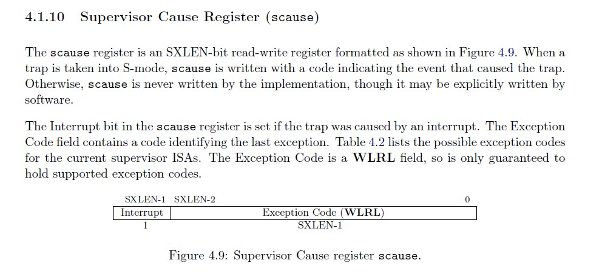
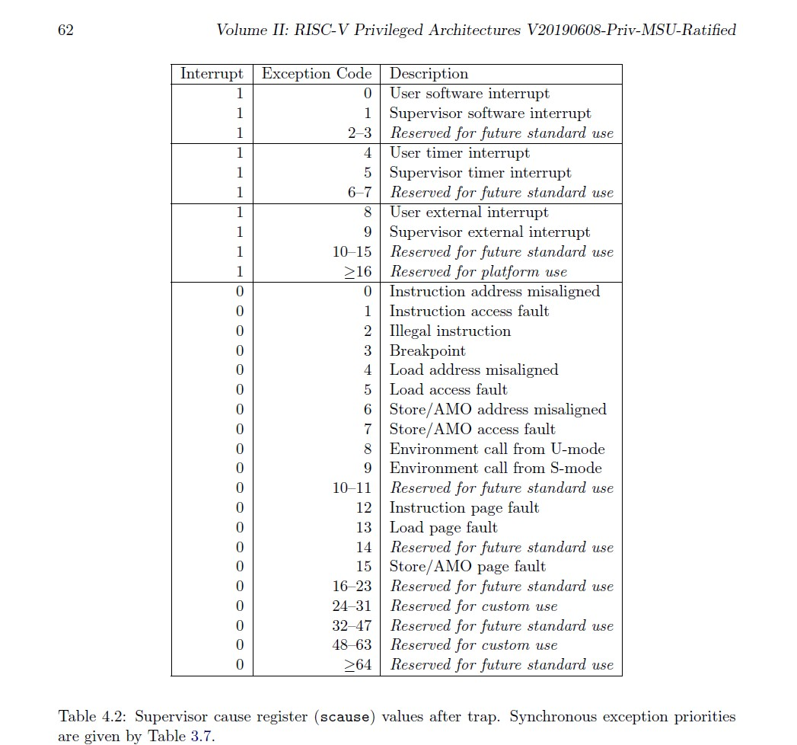

> 来源：[中断处理程序](http://8.135.34.58/lab2026/_book/lab3/lab3_3_3_trap.html)

<span id="中断处理程序"></span>

### 中断处理程序

中断处理需要初始化，所以我们在`init.c`里调用一些初始化的函数

``` text
// kern/init/init.c
#include <trap.h>
int kern_init(void) {
    extern char edata[], end[];
    memset(edata, 0, end - edata);
    cons_init();  // init the console
    const char *message = "(THU.CST) os is loading ...\0";
    //cprintf("%s\n\n", message);
    cputs(message);
    print_kerninfo();
    // grade_backtrace();
    idt_init();  // init interrupt descriptor table
    pmm_init();  // init physical memory management
    idt_init();  // init interrupt descriptor table
    clock_init();   // init clock interrupt
    intr_enable();  // enable irq interrupt
    // LAB3: CAHLLENGE 1 If you try to do it, uncomment lab3_switch_test()
    // user/kernel mode switch test
    // lab3_switch_test();

    /* do nothing */
    while (1)
        ;
}
// kern/trap/trap.c
void idt_init(void) {
    extern void __alltraps(void);
    //约定：若中断前处于S态，sscratch为0
    //若中断前处于U态，sscratch存储内核栈地址
    //那么之后就可以通过sscratch的数值判断是内核态产生的中断还是用户态产生的中断
    //我们现在是内核态所以给sscratch置零
    write_csr(sscratch, 0);
    //我们保证__alltraps的地址是四字节对齐的，将__alltraps这个符号的地址直接写到stvec寄存器
    write_csr(stvec, &__alltraps);
}
//kern/driver/intr.c
#include <intr.h>
#include <riscv.h>
/* intr_enable - enable irq interrupt, 设置sstatus的Supervisor中断使能位 */
void intr_enable(void) { set_csr(sstatus, SSTATUS_SIE); }
/* intr_disable - disable irq interrupt */
void intr_disable(void) { clear_csr(sstatus, SSTATUS_SIE); }
```

trap.c的中断处理函数trap, 实际上把中断处理,异常处理的工作分发给了interrupt_handler()，exception_handler(), 这些函数再根据中断或异常的不同类型来处理。

``` text
// kern/trap/trap.c
/* trap_dispatch - dispatch based on what type of trap occurred */
static inline void trap_dispatch(struct trapframe *tf) {
    //scause的最高位是1，说明trap是由中断引起的
    if ((intptr_t)tf->cause < 0) {
        // interrupts
        interrupt_handler(tf);
    } else {
        // exceptions
        exception_handler(tf);
    }
}

/* *
 * trap - handles or dispatches an exception/interrupt. if and when trap()
 * returns,
 * the code in kern/trap/trapentry.S restores the old CPU state saved in the
 * trapframe and then uses the iret instruction to return from the exception.
 * */
void trap(struct trapframe *tf) { trap_dispatch(tf); }
```

interrupt_handler()和exception_handler()是我们需要实现的第二个功能模块。

下面是RISCV标准里`scause`的部分，可以看到有个scause的数值与中断/异常原因的对应表格。





下一节我们将仔细讨论如何设置好时钟模块。
