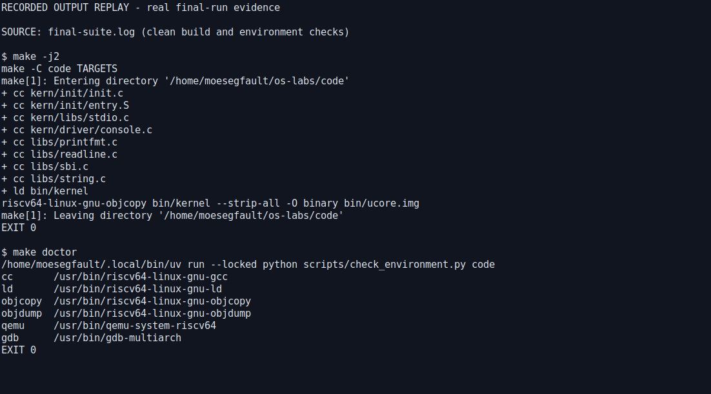
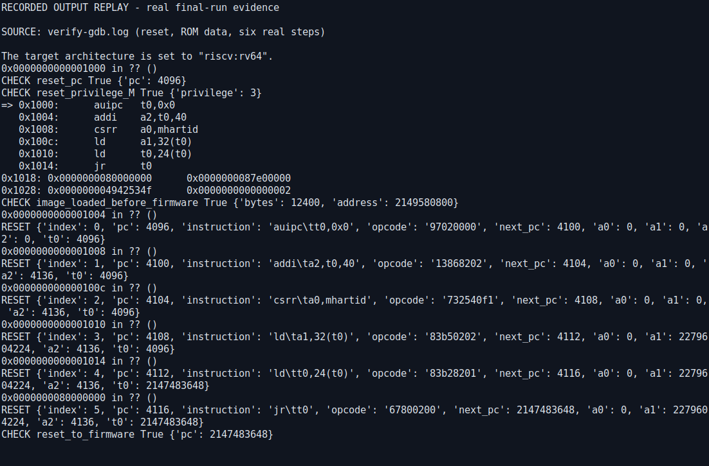
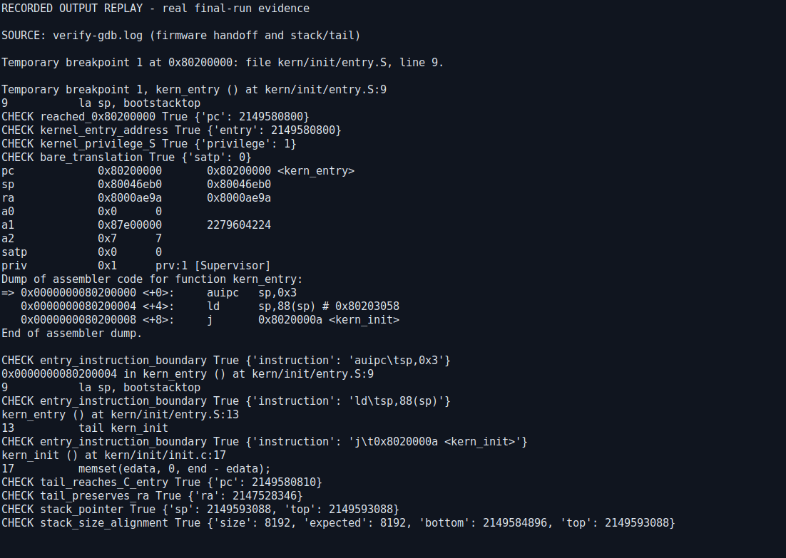
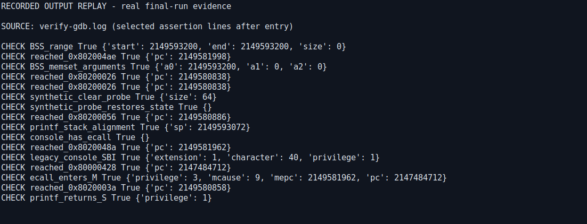
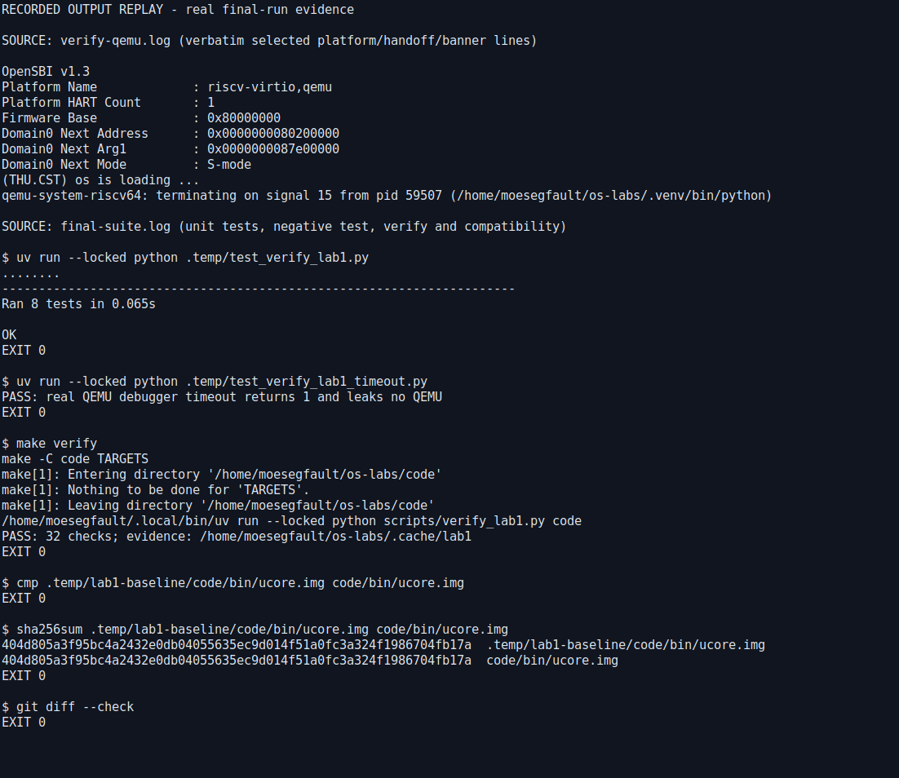

# 操作系统实验报告

## 实验基本信息

| 项目 | 内容 |
| --- | --- |
| **实验名称** | Lab 1：比麻雀更小的麻雀（最小可执行内核） |
| **小组成员** | [学号1—姓名1]、[学号2—姓名2]、[学号3—姓名3] |
| **完成日期** | 2026-10-01（Asia/Singapore，UTC+8） |
| **实验分支与目录** | `lab1`；源码 `code/`，报告及证据 `report/` |

> 成员与人工分工按用户明确要求保留占位符，其余分析和测试来自本次实际操作。两道练习均为理解与调试题，没有要求实现分页、中断或调度器；本次不以增加无关内核功能来冒充完成实验。

### 小组分工

| 成员 | 负责的练习/模块 | 报告分工 |
| --- | --- | --- |
| [学号1—姓名1] | [填写真实分工] | [填写真实分工] |
| [学号2—姓名2] | [填写真实分工] | [填写真实分工] |
| [学号3—姓名3] | [填写真实分工] | [填写真实分工] |

实际 AI 工作分工：主代理核对范围、补充入口注释、整合报告与截图、复测并执行 Git 交付；子代理分别完成 GDB 自动验证、课程要求和权威资料核对、最终交付独立复核。AI 分工不替代上表的人类成员分工。

## 一、实验目的

1. 理解裸机内核（freestanding kernel）为何必须自己建立 C 运行所需的栈与全局数据初始状态。
2. 将汇编伪指令（pseudoinstruction）`la`、`tail` 与最终机器指令及寄存器变化对应起来。
3. 使用 QEMU 的调试接口（GDB stub）和 GDB，观察复位跳板（reset trampoline）、OpenSBI 与内核之间的控制权转移。
4. 区分机器模式（Machine mode，M-mode）与监管者模式（Supervisor mode，S-mode），避免把物理地址直接等同于 M-mode。
5. 形成“课程要求→源码契约→编译产物→运行观察”的证据链，诚实说明验证边界。

## 二、实验环境

| 项目 | 本次实际环境 |
| --- | --- |
| 宿主与发行版 | Windows / WSL2；Ubuntu 24.04.5 LTS |
| WSL 内核 | `6.18.33.2-microsoft-standard-WSL2`；宿主架构 x86_64 |
| 实验仓库 | `/home/moesegfault/os-labs` |
| 目标机器 | QEMU `virt`，RV64，默认 1 个 hart（硬件线程），默认 RAM 128 MiB |
| C 编译器 | `riscv64-linux-gnu-gcc` 13.3.0 |
| 汇编/链接工具 | GNU Binutils 2.42 |
| 模拟器 | `qemu-system-riscv64` 8.2.2 |
| 固件 | 默认 OpenSBI v1.3；横幅中 Runtime SBI Version 为 1.0，两者含义不同 |
| 调试器 | `gdb-multiarch` 15.1 |
| 构建方式 | 根 Makefile 转发至 `code/Makefile`，保留 `-O2`、`-g`、`-nostdinc` 与直接 `ld -nostdlib` |
| Python 工具 | uv 0.12.21、CPython 3.14.7；`uv.lock` 锁定依赖 |
| 截图方式 | Xvfb 的私有显示服务 + XTerm + ImageMagick `import`；实际终端显示保留的测试输出 |

### AI 工具

| 成员 | AI 编程工具 | 底层模型 | 备注 |
| --- | --- | --- | --- |
| [学号—姓名] | Codex 桌面应用，主代理与三个子代理 | [按实际使用界面填写精确模型版本] | 本次可验证记录没有提供精确模型版本，不猜测 |

环境和 CLion 配置的历史记录见 [开发说明](../docs/development.md)。本报告不把此前的 IDE 检查冒充本次 GDB 实验，也不声称本次重新验证了实时 IDE 状态。

## 三、实验整体逻辑分析

### 3.1 本章节的逻辑主线

本章研究的不是“让已有操作系统执行一个 C 程序”，而是“让一个没有进程、没有标准库、没有 C 启动代码的最小内核开始执行”。因此要逐层回答：程序在哪里？CPU 从哪里取指？谁设置 C 需要的栈？未显式初始化的数据由谁清零？没有操作系统时如何打印？

```text
宿主构建：C/汇编 → 对象文件 → 链接脚本布局 → ELF 与裸镜像
                                          ↓ QEMU 在运行前装入 RAM
客体执行：0x1000 复位 ROM（M-mode）
           → 0x80000000 OpenSBI（M-mode）
           → 0x80200000 kern_entry（S-mode，satp=0）
           → 设置内核栈 → tail kern_init
           → 清零 [edata,end) → cprintf → SBI ecall → 固件 UART 输出
           → 无限循环（本实验预期终态）
```

ELF（Executable and Linkable Format）携带节、入口和调试符号；裸镜像（raw image）只有字节，没有 ELF 元信息。本实验 QEMU `-kernel bin/ucore.img` 使用裸镜像，GDB 则加载 `bin/kernel` 的符号。必须保证这两个文件来自同一次构建。

### 3.2 功能的逐步实现

| 顺序 | 模块 | 作用与前置关系 |
| --- | --- | --- |
| 1 | `code/Makefile` / `tools/function.mk` | 交叉编译内核与内部库，不能把宿主 Linux libc 链入裸机内核 |
| 2 | `tools/kernel.ld` | 基地址 `0x80200000`，组织 `.text`、`.rodata`、`.data`、BSS；导出 `edata`、`end` |
| 3 | QEMU / OpenSBI | QEMU 装入镜像并生成复位 ROM，OpenSBI 初始化运行环境并交接到内核 |
| 4 | `kern/init/entry.S` | 建立自己的栈后才进入 C，否则 C 函数可能破坏固件栈或访问无效地址 |
| 5 | `kern_init()` | 先确保零初始化语义，再输出启动横幅并停留在内核 |
| 6 | 控制台与 SBI | 没有用户态系统调用或 libc；通过固件接口使用平台控制台 |
| 7 | GDB 验证 | 将上述意图与实际 PC、SP、特权级、内存及机器指令对照 |

### 3.3 核心函数与模块

```c
int kern_init(void) __attribute__((noreturn));
void *memset(void *s, char c, size_t n);
int cprintf(const char *fmt, ...);
void cons_putc(int c);
void sbi_console_putchar(unsigned char ch);
uint64_t sbi_call(uint64_t sbi_type, uint64_t arg0,
                  uint64_t arg1, uint64_t arg2);
```

- `kern_entry` 是汇编标签，不是可直接假定有正常 C 调用者的函数。它接收固件建立的机器上下文并替换栈。
- `kern_init()` 用 `memset(edata, 0, end-edata)` 实现 BSS（Block Started by Symbol）的零初始化语义。`noreturn` 是编译器契约，实际不返回由末尾无限循环保证。
- `cprintf` 建立变参（variadic arguments），经 `vcprintf` / `vprintfmt` 格式化，再逐字符调用 `cputch` / `cons_putc`。优化可能内联这些层，不应要求所有源码函数都有独立可断点的调用帧。
- `sbi_console_putchar` 通过监管者二进制接口（Supervisor Binary Interface，SBI）的旧式控制台扩展（legacy console extension）输出字符；`a7=1`、`a0=字符`，`ecall` 请求 OpenSBI。不是 Linux 的 `write` 系统调用。

## 四、实验内容与实现

### 练习一：理解内核启动中的程序入口操作

**负责人：** [学号—姓名]

#### 1. `la sp, bootstacktop` 完成什么操作？目的是什么？

它把 `bootstacktop` 标签的**地址**装入栈指针（Stack Pointer，SP），不是读取该标签处的“栈顶数据”。内核由此从固件的私有栈切换到自己的启动栈。

`KSTACKPAGE=2`，`PGSIZE=4096`，所以 `KSTACKSIZE=8192`。本次符号值为：

| 符号 / 不变量 | 实测值 |
| --- | --- |
| `bootstack` | `0x80201000` |
| `bootstacktop` | `0x80203000` |
| 栈区间 | `[0x80201000, 0x80203000)`，8192 字节 |
| 执行完 `la` 的 SP | `0x80203000` |
| 调用 `cprintf` 前的 SP | `0x80202ff0` |
| 栈方向与对齐 | 向低地址增长；函数入口满足 16 字节对齐 |

栈顶是区间末端的 one-past-end 地址，首次压栈或分配栈帧先减 SP 再使用低地址内存。栈用于保存返回地址、被调用者保存寄存器和局部数据。标准 RISC-V 应用二进制接口（Application Binary Interface，ABI）要求栈向下增长并保持 16 字节对齐，页对齐的两页启动栈满足这一条件。[RISC-V psABI](https://riscv-non-isa.github.io/riscv-elf-psabi-doc/#_integer_calling_convention)

该栈放在 `.data`，而不是 `kern_init` 会清零的 BSS 区间，避免在自己的当前执行栈上进行清零。

**不能把伪指令固定解释成一条机器指令。** 本环境最终反汇编为：

```text
0x80200000 <kern_entry+0>: auipc sp,0x3
0x80200004 <kern_entry+4>: ld    sp,88(sp)  # 0x80203058
0x80200008 <kern_entry+8>: j     0x8020000a <kern_init>
```

前两条实现 `la`：第一条算出 `0x80203000` 附近的 PC 相对基址，第二条从全局偏移表（Global Offset Table，GOT）的 `0x80203058` 读到标签地址 `0x80203000`。这是当前工具链的实际展开；在非位置无关代码（Position-Independent Code，PIC）模式中，常见展开是 `auipc` + `addi`，不能拿它替代本次实测。[RISC-V 汇编手册](https://github.com/riscv-non-isa/riscv-asm-manual/blob/main/src/asm-manual.adoc)

#### 2. `tail kern_init` 完成什么操作？目的是什么？

它把控制权直接转移至 `kern_init`，不创建一个需要返回 `kern_entry` 的调用关系，也不写入新的返回地址寄存器（Return Address，RA）。正常 `call` 会为返回建立 `ra`；`tail` 的跳转目的寄存器是 `x0`，旧 `ra` 保持不变。

常见未松弛展开是 `auipc` + `jalr x0,...`。本次链接器松弛（linker relaxation）把它缩短为地址 `0x80200008` 的 16 位压缩跳转 `j 0x8020000a`。验证脚本逐条执行最终二进制指令，确认到达 C 入口时：`PC=&kern_init`、`SP=&bootstacktop`、`RA=跳转前的 RA`。

这里 `kern_init` 永不返回，因此不需要生成返回帧。若未来误让它 `return`，它不会正常返回到 `kern_entry` 的下一条指令，而可能跳向遗留固件地址；不能把保留下来的 `ra` 当作有效的内核调用链。

### 练习二：使用 GDB 验证启动流程

**负责人：** [学号—姓名]

#### 1. 复现方法

从仓库根目录执行：

```sh
uv sync --locked
make clean
make -j2
make doctor
make compdb
make smoke
make verify
```

`make verify` 自动选一个临时 localhost 端口，按真实 Makefile 配方启动自己的 QEMU，使用 `-S` 暂停客体，在 batch GDB 中记录并断言状态。所有子进程都有超时并仅清理本次创建的 QEMU，不使用全局 `pkill`。原始命令、GDB 脚本、输出和 JSON 结果保存在 `.cache/lab1/verify-*`。

手工观察时可开两个终端：

```sh
# 终端 A
make debug
# 终端 B
make gdb
```

随后在 GDB 中执行：

```gdb
set pagination off
info registers pc sp ra a0 a1 a2 priv satp
x/6i 0x1000
x/4gx 0x1018
x/3i 0x80200000
si
si
si
si
si
si
# 现在 PC 应为 0x80000000
b *kern_entry
continue
info registers pc sp ra a0 a1 priv satp
disassemble kern_entry
si
si
p/x $sp
p/x &bootstacktop
set $old_ra = $ra
si
p/x $pc
p/x $ra
p/x $old_ra
```

调试前确认端口空闲；如需改端口，两侧都使用 `GDB_PORT=<端口>`。结束后退出 GDB，并单独停止 QEMU。

#### 2. 加电后最初几条指令在哪里？完成哪些功能？

本次连接时 `PC=0x1000`、`priv=3`，处于 M-mode。这里是 **QEMU 生成的复位 ROM**，不是内核，也不是地址 `0x80000000` 的 OpenSBI 主体。逐条单步观察如下：

| PC | 实际指令 | 功能与执行后关键值 |
| --- | --- | --- |
| `0x1000` | `auipc t0,0x0` | 将当前 PC 放入 `t0`，得到 ROM 数据寻址基准 `0x1000` |
| `0x1004` | `addi a2,t0,40` | `a2=0x1028`，指向固件动态启动信息（fw_dynamic_info） |
| `0x1008` | `csrr a0,mhartid` | 读取当前 hart ID，本次 `a0=0` |
| `0x100c` | `ld a1,32(t0)` | 从 `0x1020` 读设备树（Flattened Device Tree，FDT）地址，本次 `a1=0x87e00000` |
| `0x1010` | `ld t0,24(t0)` | 从 `0x1018` 读固件入口，`t0=0x80000000` |
| `0x1014` | `jr t0` | 跳到 OpenSBI 第一条指令，`PC=0x80000000` |

ROM 中 `0x1018`、`0x1020` 存放上述两个地址；`0x1028` 的动态信息魔数是 `0x4942534f`。不能继续将这些数据误反汇编成真正执行过的启动指令。上述布局与 [QEMU v8.2.2 的复位向量实现](https://github.com/qemu/qemu/blob/v8.2.2/hw/riscv/boot.c#L349-L398) 相符。

**范围限制：** `0x1000` 是当前 QEMU `virt` 平台的复位地址，不是 RISC-V 对所有真实芯片规定的统一地址。架构规定复位后进入 M-mode，复位 PC 则由实现决定。[RISC-V 特权架构规范](https://docs.riscv.org/reference/isa/v20240411/priv/machine.html)

#### 3. OpenSBI 如何交接到第一条内核指令？

到达 `0x80000000` 后继续执行固件，在 `b *kern_entry` 处停住。本次观察：

| 项目 | 内核第一条指令执行前的状态 |
| --- | --- |
| `PC` | `0x80200000`，与链接入口一致 |
| `priv` | `1`，S-mode |
| `satp` | `0`，Bare 模式，无分页地址翻译 |
| `a0` | `0`，启动 hart ID |
| `a1` | `0x87e00000`，设备树地址 |
| `sp` | 固件栈 `0x80046eb0`；两条 `la` 机器指令后切换到 `0x80203000` |

固件横幅同时给出 `Firmware Base=0x80000000`、`Domain0 Next Address=0x80200000`、`Domain0 Next Arg1=0x87e00000`、`Domain0 Next Mode=S-mode`，与 GDB 观察互相印证。

OpenSBI 的交接例程设置 `mepc`、`mstatus.MPP`、清除 S-mode 的 `satp`，准备 `a0/a1`，最后用 `mret` 转移控制权与特权级。[OpenSBI v1.3 交接实现](https://github.com/riscv-software-src/opensbi/blob/v1.3/lib/sbi/sbi_hart.c#L720-L777) 本实验用断点跨过大量固件内部初始化指令，不声称逐条验证了 OpenSBI 的全部内部行为。

`0x80200000` 可直接作为物理 RAM 地址，是因为 `satp.MODE=Bare`，并不说明内核仍处于 M-mode。特权级与地址翻译是两个独立维度，且物理内存保护（Physical Memory Protection，PMP）仍可限制 S-mode 访问。[RISC-V 监管者规范](https://docs.riscv.org/reference/isa/v20240411/priv/supervisor.html)

#### 4. 对指导书 watchpoint 建议的实测修正

指导书建议 `watch *0x80200000` 观察 SBI 加载内核。本次在 **PC 仍为 `0x1000`、固件尚未运行** 时，读取入口起共 12400 字节，与磁盘 `ucore.img` 逐字节相等。

因此在当前 `-kernel` 路径中，内核是 QEMU 宿主初始化阶段预装入 RAM，不是 OpenSBI 执行过程中再复制进去。写监视点（watchpoint）没有可期待的“固件加载写入”事件；应使用入口执行断点验证交接。区别是 **装载镜像** 与 **移交控制权**，两者不必由同一个模块完成。[QEMU v8.2.2 内核加载实现](https://github.com/qemu/qemu/blob/v8.2.2/hw/riscv/boot.c#L198-L253)

### 实现范围、提示词和实际迭代

最终用户提示词原文及历史任务见 [prompt.md](prompt.md)。本次没有用户指定的 Challenge，未编造额外练习。

- `entry.S`：补充建立私有栈、栈区间、非返回尾跳转的英文语义注释。
- `init.c`：补充 Doxygen 契约注释并修正循环缩进；启动文字、零初始化代码、无限循环行为保持原样。
- `scripts/verify_lab1.py`：增加可复现的真实 GDB 验证；根 Makefile 增加 `make verify`，不替换课程构建。
- `scripts/capture_lab1.py`：把保留的真实输出放入 XTerm 并截图，明确是输出回放，而不是伪造实时交互。

实际迭代中发现：

1. Ubuntu 工具链生成的 `la` 是 GOT 加载，`tail` 为压缩跳转，因此验证按反汇编而不是假设固定指令长度。
2. 当前链接产物的 BSS 为空，`edata=end=0x80203070`。不能宣称观察到真实 BSS 的非空清零。
3. 对 `ecall` 单步后，QEMU/GDB 的停点可能已完成固件处理并回到 S-mode；不能把“单步后没有停在 M-mode”误判为没发生特权陷入。改用固件陷入向量处的执行断点，再验证陷入与返回。细节见 [验证记录](../docs/lab1-verification.md)。

## 五、测试与验证

### 5.1 构建与不破坏已有行为

干净构建使用 `-Wall -Werror`，八个编译单元（七个 C、一个汇编）全部成功。`make doctor` 找到编译器、链接器、objcopy、objdump、QEMU、GDB；`make compdb` 生成八条来自真实 Makefile 的命令；`uv lock --check` 检查锁文件一致性。

将起始提交 `74d683d` 的 `code/` 用 `git archive` 解出到根目录 `.temp/lab1-baseline/`，用相同工具链独立构建，和交付版裸镜像执行 `cmp`：逐字节相同。两者 SHA-256 都是：

```text
404d805a3f95bc4a2432e0db04055635ec9d014f51a0fc3a324f1986704fb17a
```

这证明本次源码注释与格式修正没有改变该工具链下的启动机器码；ELF 调试信息包含行号变化，不声称 ELF 本身逐字节相同。

另外，将提交 `4b9da2b` 用 `git archive` 导出到无 `.cache`、`.temp`、`.venv` 的干净目录，重新建立锁定环境并执行构建、doctor、compdb、smoke、verify，均通过；再次得到 32 项成功断言，裸镜像与主工作区相同，且仅使用已提交的显示面板成功复现五张截图。原始记录见 [干净导出复测](evidence/clean-checkout.log)。Git 对原始证据禁用文本换行转换，导出后的证据及截图哈希也全部匹配。

### 5.2 验证项及边界

| 项目 | 验证内容 |
| --- | --- |
| 复位 | 实测 `PC=0x1000`、M-mode；记录六条指令及每步关键寄存器 |
| 预装载 | 复位停住时，12400 字节镜像已经与文件相同 |
| 固件交接 | `0x80000000` → `0x80200000`，入口 S-mode、`satp=0` |
| 启动栈 | SP 等于 `bootstacktop`；栈 8192 字节，满足 16 字节对齐 |
| 尾跳转 | 实际 `j` 到 C 入口，不改变 `ra` |
| 初始化清零 | 实际 `memset` 参数为 `a0=edata`、`a1=0`、`a2=0`，BSS 空区间 |
| 补充清零探针 | 仅在被调试客体内给 `end` 后 64 字节写入 `0xa5`，临时扩大一次 `memset` 的长度，断言全部变零，再恢复原数据；不改源码与镜像 |
| SBI 输出 | 首字符 `'('` 的 `a7=1`、`a0=40`；验证 S-mode ecall、固件处理及返回 |
| 终态 | 输出预期 `(THU.CST) os is loading ...`，保持内核无限循环；主动停止 QEMU 是测试清理，不是崩溃 |

**关于 BSS 的精确表述：** 空区间的全零断言是空真（vacuous truth），不等于测试了非空 BSS。64 字节补充探针测试的是现有 `memset` 清零实现，不是原始启动路径出现了非空 BSS。正常未修改客体的启动另由 `make smoke` 验证。

本次 `make verify` 的 **32 项断言全部通过**（其中包含多个实际指令边界和断点到达断言，不代表 32 种独立内核功能）；八项单元测试通过，真实 QEMU 超时负例按预期返回失败且没有泄漏进程，独立验证器另通过五项失败注入（failure injection）检查，见 [独立验收记录](../docs/lab1-delivery-validation.md)。

**关于 grader：** 此课程源码没有 `tools/grade.sh`。所以没有 `make grade` 通过截图、课程分数或官方 grader 通过声明。`make verify` 是本次新增的针对两道练习的断言检查，不冒充课程评分脚本。

### 5.3 真实输出截图与原始证据

截图由真实 XTerm 窗口捕获，展示本次已保留的原始输出；显示面板明确标注 RECORDED OUTPUT REPLAY。它们不是手工绘制的终端图，也不声称拍摄了真人实时输入过程。完整原始输出和命令保留在 [evidence/](evidence/README.md)，截图只是便于审阅的分段展示。

**构建与环境检查：**



**复位 ROM、预装载与六条单步：**



**内核入口、栈初始化与尾跳转：**



**初始化、SBI 陷入和返回验证：**



**QEMU 启动输出与测试结果：**



## 六、实验总结与收获

### 6.1 实验知识与 OS 原理的对应

| 实验知识点 | OS 原理对应 | 联系与差异 |
| --- | --- | --- |
| 固定加载地址与链接节布局 | 程序装载、地址空间 | 本实验使用单一物理布局，不是用户进程的虚拟地址空间与动态装载 |
| 固件交接与 `mret` | 特权级与保护 | 明确机器级服务与 S-mode 内核边界，不是完整用户态→内核态系统调用 |
| 启动栈与 ABI | 执行上下文与调用约定 | 仅一个启动上下文，不涉及线程切换、内核栈切换或抢占 |
| `edata/end` 与 `memset` | 全局数据生命周期 | 内核自己承担零初始化；本次 BSS 实测为空，不能扩大结论 |
| SBI 字符输出 | 硬件抽象与驱动层次 | 复用固件 UART 支持，没有实现完整中断驱动、缓冲控制台或设备模型 |
| `satp=0` | 地址翻译和隔离 | 观察到 Bare，不等于实现了页表、TLB 或进程内存保护 |
| GDB 原始指令与源码对照 | 软件栈分层与验证 | 伪指令、内联、压缩指令使源码行与机器指令不一一对应 |

### 6.2 本实验尚未覆盖的重要原理

- 物理页分配、多级页表、转换后备缓冲器（Translation Lookaside Buffer，TLB）及缺页处理。
- 中断与通用异常处理、时钟中断、抢占、原子操作及并发同步。
- 进程/线程创建、上下文切换（context switch）、调度、用户态系统调用。
- 文件系统、缓存、持久化、设备中断和 DMA（Direct Memory Access）。
- 安全启动（secure boot）、密码学验证、隔离、资源回收与故障恢复。

本次只形成“可启动、可打印、可调试”的最小闭环，不把固件已经提供的功能算作自己实现的内核功能。

### 6.3 AI 协作经验与工程判断

1. 先检查课程真实题目，再拆解工作。两道理解题不应被扩张成后续实验的分页或调度开发。
2. 文档是待验证的解释，不是运行事实。预装载证据和 ROM 反汇编纠正了两个易混淆的指导书说法。
3. 以最终二进制为依据：`la` 的 GOT 展开、压缩 `tail`、优化后的断点和空 BSS 都来自本环境，而不是通用示例。
4. 区分无侵入观察、客体内修改探针与真实正常启动。添加断言也必须说明它证明了什么，尤其避免空真或“日志里出现 PASS”式测试。
5. 保持已有外部契约：没有改加载地址、符号、启动字符串、原 Make 命令或内核终态；相同裸镜像是额外兼容性证据。
6. 有边界地记录风险：现有 SBI 内联汇编寄存器约束、入口对对象顺序的依赖值得后续加固，但本次没有进行未经要求的大范围重构。详细来源与风险见 [源码分析](../docs/lab1-source-notes.md)。

### 6.4 与成熟工程及研究的联系

成熟实践要求区分宿主模拟器与客体 CPU，借助 `-S` 和受控调试接口，在明确断点观察状态；本次只在 loopback 暴露 GDB 并清理自己创建的进程。[QEMU 官方 GDB 文档](https://www.qemu.org/docs/master/system/gdb.html)

学术上，Klein 等人在 *ACM Transactions on Computer Systems* 发表的 seL4 完整验证工作表明，源代码意图、二进制行为和机器模型之间需要明确连接，同时仍需交代启动代码、汇编和硬件等可信假设（trusted assumptions）。对本实验的启发不是引入复杂证明工具，而是明确启动不变量（invariants），检查编译结果并公开验证边界。本实验没有形式化验证（formal verification），上述论文不为本内核提供正确性证明。[Klein et al., 2014, DOI:10.1145/2560537](https://sel4.systems/Research/pdfs/comprehensive-formal-verification-os-microkernel.pdf)

可取的下一步是为后续实验新增的非空 BSS、页表或陷入入口增加同样可观察的不变量，而不是把 Lab 1 的有限测试泛化为“操作系统已经正确”。
